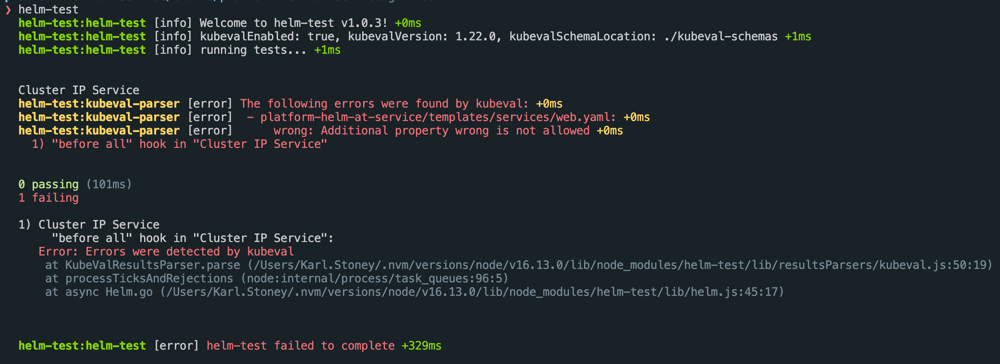
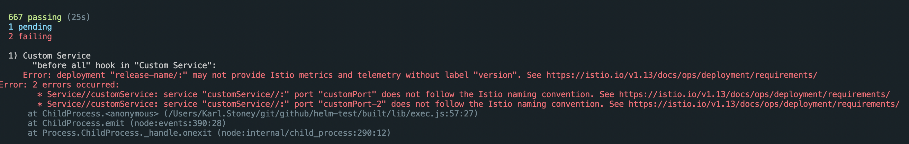

# helm-test

[Mocha](https://mochajs.org/) based testing for [Helm](https://github.com/kubernetes/helm) packages!


## What does it do?

[Helm](https://github.com/kubernetes/helm) is a great tool for packaging and templating your kubernetes definitions. However as your templates grow in complexity, and you start to introduce conditionals and other logic it becomes increasingly easy to unwittingly break them.

I wanted to take some of the tooling that I use when coding, and create a simple cli to test the manifest files that helm generates. `helm-test` will run helm to generate your manifests and then parse the results into JSON for you to perform assertions against.

As of version `1.0.0`, you can also opt to run your manifests through `kubeval`.

As of version `1.1.0`, you can also opt to run your manifests through `istioctl`.

## How to use it

### Installation

`helm-test` is distributed as a command line interface, simply type `npm install -g helm-test`.

I assume you've got `helm` downloaded as you're wanting to write tests on helm charts, but if you don't, then - [download helm](https://github.com/helm/helm/releases), and ensure it's available on your path.

As of version `1.0.0`, only `helm3` is supported.

#### Kubeval

You can have `helm-test` run your manifests through `kubeval` for some additional checking. By default `kubeval` will attempt to download the schemas, but if you have lots of tests then I **strongly** suggest downloading a copy of the schemas you are interested in:

```
mkdir -p /tmp/kubeval-schemas
curl https://codeload.github.com/yannh/kubernetes-json-schema/tar.gz/master |
  tar -C /tmp/kubeval-schemas --strip-components=1 -xzf - \
  kubernetes-json-schema-master/v1.22.0-standalone-strict
```

Then you can enable kubeval in `helm-test`:

```
export HELM_TEST_KUBEVAL_ENABLED=true
export HELM_TEST_KUBEVAL_KUBERNETES_VERSION=1.22.0
export KUBEVAL_SCHEMA_LOCATION=/tmp/kubeval-schemas
```

If you plan on running `kubeval` too, make sure you've [downloaded that](https://github.com/instrumenta/kubeval/releases) too and it's accessible on your path.

Whenever you call `helm.go()` in your tests, the templated manifests will also be passed through kubeval:



#### IstioCTL

If you are an istio user, you can ask `helm-test` to run your manifests through `istioctl validate` as well.

Make sure you've [downloaded](https://github.com/istio/istio/releases) the `istioctl` binary and it's available on your path.

Then enable the feature in `helm-test`:

```
export HELM_TEST_ISTIOCTL_ENABLED=true
```



### Writing tests

Tests should be placed in the root of your helm chart, in a `tests/` folder like so:

```
/
  Chart.yaml
  values.yaml
  charts/
  templates/
  tests/
    your-tests.js
    some-more-tests.js
```

Your test specification follows the popular Mocha layout. You can see an example [here](examples/service.js)

There are some global helper variables defined for use in your tests:

#### helm

This is the root context and exposes the following functions:

- `withValueFile(path)`: Specify a value file to use when running helm, relative to the root of your chart. You can call this multiple times
- `set(key, value)`: Allows you to override a specific value, for example `set('service.port', '80')` would do `--set service.port=80` when running helm
- `go(done)`: Run a helm template generation and parse the output

#### yaml

This global helper function allows you to parse yaml using `js-yaml`. This is useful for scenarios like a configmap containing a string block which sub contains yaml, that you wish to assert on.

eg.

```
const json = yaml.load(results.ofType('ConfigMap')[0].spec.data);
json.metadata.name.should.eql('some-manifest');
```

#### results

After running `helm.go`, the `results` variable will be populated, and it exposes the following:

- `length`: The number of manifest files
- `ofType(type)`: Get all manifests of a given type

### Running your tests

Is a simple as doing `helm-test`:

```
❯ helm-test
  helm-test [info] Welcome to helm-test v0.1.6! +0ms
  helm-test [info] Testing... +0ms


  Helm Chart
    ✓ should have three manifests
    The Service
      ✓ should have standard labels
      ✓ should have valid metadata.name
      ✓ should be a LoadBalancer
      ✓ should be on an internal ip
      ✓ should have a single http-web port
      ✓ should select the right pods
    The StatefulSet
      ✓ should have the right name
      ✓ should have standard labels
      ✓ should have a serviceName
      ✓ should have a single replica
      ✓ should be a RollingUpdate strategy
      ✓ should have matching matchLabels and template labels
      Containers
        ✓ should have two containers
        Master
          ✓ should use the right image
          ✓ should limit 2gig of ram
          ✓ should limit 1.8 CPU
          ✓ should have a http-web port
    The ConfigMap
      ✓ should have standard labels
      ✓ should have valid metadata
      ✓ should have a docker-host key


  21 passing (123ms)

  helm-test [info] Complete. +443ms
```

### Constantly running tests and watching for changes

You can have helm-test run every time it detects a change in your chart by simply doing `helm-test --watch`

## License

Copyright (c) 2022 Karl Stoney
Licensed under the MIT license.
