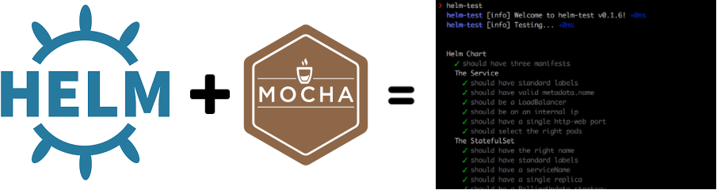

# helm-test
A [Mocha](https://mochajs.org/) based testing for [Helm](https://github.com/kubernetes/helm) packages!



## What does it do?
[Helm](https://github.com/kubernetes/helm) is a great tool for packaging and templating your kubernetes definitions.  However as your templates grow in complexity, and you start to introduce conditionals and other logic it becomes increasingly easy to unwittingly break them.

I wanted to take some of the tooling that I use when coding, and create a simple cli to test the manifest files that helm generates.

## How to use it
### Installation
helm-test is distributed as a command line interface, simply type `npm install -g helm-test`.  Once you've got that installed, you just need to write some tests.

### Writing tests
Tests should be placed in the root of your helm chart, in a `tests/` folder like so:

```
/
  Chart.yaml
  values.yaml
  charts/
  templates/
  tests/
    your-tests.js
    some-more-tests.js
```

Your test specification follows the popular Mocha layout.  You can see an example [here](examples/service.js)

There are some global helper variables defined for use in your tests:

#### helm
This is the root context and exposes the following functions:

  - `withValueFile(path)`: Specify a value file to use when running helm, relative to the root of your chart.  You can call this multiple times
  - `go(done)`: Run a helm template generation and parse the output

#### results
After running `helm.go`, the `results` variable will be populated, and it exposes the following:

  - `length`: The number of manifest files
  - `ofType(type)`: Get all manifests of a given type

### Running your tests
Is a simple as doing `helm-test`:

```
$ helm-test
  helm-test [info] Welcome to helm-test v0.1.1! +0ms
  helm-test [info] Testing... +0ms


  Helm Chart
    ✓ should have three manifests
    The Service
      ✓ should be a LoadBalancer
      ✓ should be on an internal ip
    The ConfigMap
      ✓ should have valid metadata
      ✓ should have a docker-host key


  5 passing (109ms)

  helm-test [info] Complete. +394ms
```

### Constantly running tests and watching for changes
You can have helm-test run every time it detects a change in your chart by simply doing `helm-test --watch`

## License
Copyright (c) 2017 Karl Stoney
Licensed under the MIT license.
